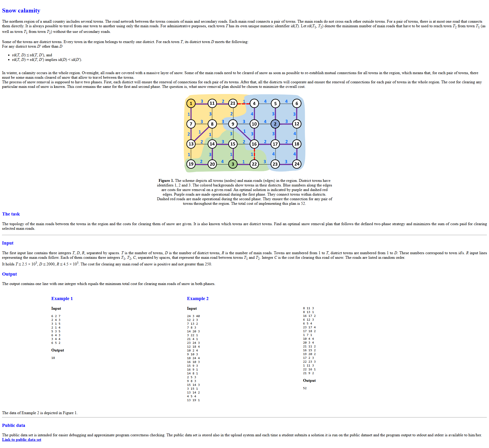

# Assignment

# Running
Source code is written in C/C++ and test dataset is in folder [datapub](./datapub). There are files: 
**.in** - input file 
**.out** - proper solution output 
Before running compile source code and stream **.in** file content to stdin, on Linux `./main < ./datapub/pub01.in` or for Windows `cmd /c "main < datapub/pub02.in"`
